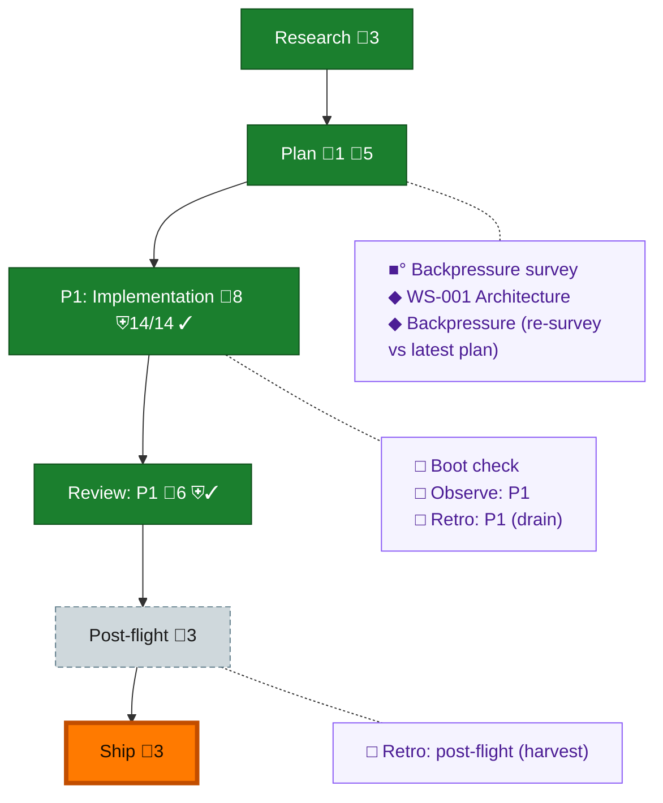

<!-- GENERATED by `harness flow render` — do not hand-edit; regenerate from the flow JSON. -->
# Flow · fs3-foundations

**Kind**: flight-plan · **Now**: ship · **Intent**: fix-0004 approved (rev-0006); phase exit reconciliation · **Nodes**: 13 · **Events**: 21

**Rail**: ◆─◆─[ ◆─◆─◆ ]─◇  ◆ Research · ◆ Plan · [ ◆ P1: Implementation · ◆ Review: P1 · ◆ Ship ] · ◇ Post-flight

**Legend** — colour = type/status: 🟩 done · 🟢 in-progress · 🟥 blocked · 🟦 known · ⬜ assumed · 🔶 decision · 🗣 user input · 🟪 harness chore (faded = not yet done) · 🤖 companion · 🛠 worker · 🟧 current (you are here). Badges: 💬 comments · 📄 artifacts · 📝 instructions · 🧰 chore (° optional / recommended / ‼ strongly-recommended; ✓ done · ✕ skipped) · ⛨ dd gate (terminal/total from the last evaluation; ✓ = open). ⛨✓/⛨✕ = a plan-validate check gate (green / not green).

## Node log

### plan · Plan
- `2026-08-26T01:51:07.400Z` · agent · validation — validate-v2: VALIDATED WITH FIXES (2 HIGH 2x, 3 MED adjudicated+fixed; revalidate 0 errors). Record: validations/plan-validation.md. Open decision: real-provider run timing gates workshop promotion.

### backpressure · Backpressure survey
- `2026-08-26T01:57:28.798Z` · agent · validation — decision:run verdict:Partial (2 RUN · 1 EXTEND · 6 BUILD · 0 ABSENT — plan is its own Phase 0) basis_sha256:12c495e17c1a6620a8e44476c3a5f072a3c401edf69014ed6ce03394633747cb artifact:assets/backpressure-coverage.md time:2026-08-26T01:57:28Z

### backpressure-0c282f8cc8aa · Backpressure (re-survey vs latest plan)
- `2026-08-26T01:59:06.404Z` · agent · validation — decision:run verdict:Partial (2 RUN · 2 EXTEND · 6 BUILD · 1 ABSENT-human) basis_sha256:0c282f8cc8aa2bd8115d5e5916e5e5409d231aa0243131debf012191f6e9b295 artifact:assets/backpressure.dd.json (dd-native; pressure links wired AC+done_when; satisfies wired task-&gt;AC) time:2026-08-26T01:59:06Z
