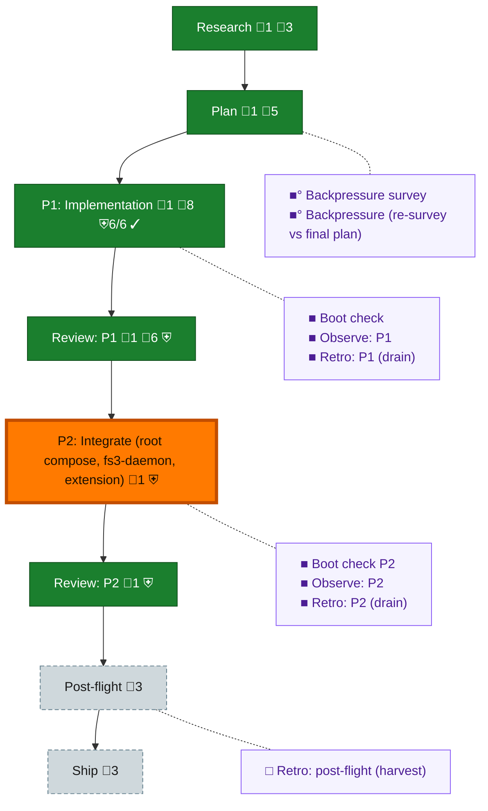

<!-- GENERATED by `harness flow render` — do not hand-edit; regenerate from the flow JSON. -->
# Flow · the-flow

**Kind**: flight-plan · **Now**: phase-2 · **Intent**: GATED: awaiting s001 phase exit + o-prime fence coordination before ox integrates (root compose, docker/, harness extension) · **Nodes**: 17 · **Events**: 39

**Rail**: ◆─◆─[ ◆─◆─◆─◆─◇ ]─◇  ◆ Research · ◆ Plan · [ ◆ P1: Implementation · ◆ Review: P1 · ◆ P2: Integrate (root compose, fs3-daemon, extension) · ◆ Review: P2 · ◇ Ship ] · ◇ Post-flight

**Legend** — colour = type/status: 🟩 done · 🟢 in-progress · 🟥 blocked · 🟦 known · ⬜ assumed · 🔶 decision · 🗣 user input · 🟪 harness chore (faded = not yet done) · 🤖 companion · 🛠 worker · 🟧 current (you are here). Badges: 💬 comments · 📄 artifacts · 📝 instructions · 🧰 chore (° optional / recommended / ‼ strongly-recommended; ✓ done · ✕ skipped) · ⛨ dd gate (terminal/total from the last evaluation; ✓ = open). ⛨✓/⛨✕ = a plan-validate check gate (green / not green).

## Node log

### research · Research
- `2026-08-26T02:49:17.399Z` · agent · validation — decision:folded-into-plan reason:no separate dossier - research grounded in s001 landed substrate (b812d4d, db-only compose), workshop 001, PRD reqs 15-20/33/4; recorded in plan research_context. time:2026-08-26T02:49Z

### plan · Plan
- `2026-08-26T02:49:17.622Z` · agent · validation — decision:done reason:dd-native plan authored via ddocs (2 phases, 6 ACs, gate matrix 4 PASS/3 NA); harness plan validate 0 errors (37 untracked-file warns resolve at first commit). time:2026-08-26T02:49Z

### phase-1 · P1: Implementation
- `2026-08-26T03:06:06.522Z` · agent · validation — verdict:done reason:tk-0101..0106 checked, dw-0101..0108 receipted by coder pij-impressive-ox; o-prime verified artifacts/GO/volumes/clean-tree. Evidence: assets/poc/docker-results.md (GO).

### review-1 · Review: P1
- `2026-08-26T03:06:06.742Z` · agent · validation — verdict:accepted reason:POC-grade review — o-prime verification pass (artifacts on disk, dw receipts, db StartedAt proof, lint+podman dry-run, volumes retained) + validate-v2 critic's plan-level pass; throwaway code, phase-2 re-implements under full review. time:2026-08-26T03:06Z

### backpressure · Backpressure survey
- `2026-08-26T02:49:17.861Z` · agent · validation — verdict:surveyed reason:assets/backpressure.dd.json 6 rows (1 EXISTS, 2 EXTEND, 3 BUILD) + 3 sensors; certainty Partial (podman by-construction only). basis_sha256:4c881421bd0ca492b903d7058fc6c65a741b6c8d74f9dd0f315783dcdd762b83 time:2026-08-26T02:49Z

### boot-1 · Boot check
- `2026-08-26T03:06:05.816Z` · agent · validation — verdict:ready reason:real 'harness boot' run 2026-08-26T03:05Z — toolchain/crate/build/compose(pg 5433)/checks all ok (fired at phase close; phase executed by remote coder seat pij-impressive-ox whose own gates proved the env)

### observe-1 · Observe: P1
- `2026-08-26T03:06:06.051Z` · agent · validation — verdict:captured reason:3 real 'harness observe' captures DL-001 (text-file-busy/atomic-mv), DL-002 (CARGO_HOME shadow), CONF-001 (zero-dep timing convergence) drained from coder report. time:2026-08-26T03:05Z

### retro-1 · Retro: P1 (drain)
- `2026-08-26T03:06:06.289Z` · agent · validation — verdict:drained reason:observe buffer drained to .harness/records/retro/2026-08-26/003.md (3 entries, dispositions task/task/plan). time:2026-08-26T03:06Z

### phase-2 · P2: Integrate (root compose, fs3-daemon, extension)
- `2026-08-26T06:44:21.710Z` · agent · validation — verdict:done reason:re-scoped phase 2 landed (95e885c docker/, abc83ab extension+docs, a50a191 dd flips) — root docker/ scripts + harness docker extension + docs/how; compose stays db-only per daemon-native ruling; checks green at o-prime verify.

### review-2 · Review: P2
- `2026-08-26T06:44:21.972Z` · agent · validation — verdict:accepted reason:infra scripts promoted from the twice-validated POC shapes (plan-002 validation + cross-platform acceptance); o-prime artifact+gate verify. Deeper review rides ship-it's CI usage of these exact scripts.

### boot-2 · Boot check P2
- `2026-08-26T06:44:22.213Z` · agent · validation — verdict:done reason:real practice — gates green per landing; observations in fleet drain 007.md (DL-007 cross-target, ops notes).

### observe-2 · Observe: P2
- `2026-08-26T06:44:22.452Z` · agent · validation — verdict:done reason:real practice — gates green per landing; observations in fleet drain 007.md (DL-007 cross-target, ops notes).

### retro-2 · Retro: P2 (drain)
- `2026-08-26T06:44:22.697Z` · agent · validation — verdict:done reason:real practice — gates green per landing; observations in fleet drain 007.md (DL-007 cross-target, ops notes).

### backpressure-1d98c4894d40 · Backpressure (re-survey vs final plan)
- `2026-08-26T02:53:32.574Z` · agent · validation — verdict:re-surveyed reason:same 6 rows re-checked after validate-v2 fixes (bp-0003 relabeled BUILD; volume-naming, locked-build, daemon-config, in-container-test rows' proofs sharpened); certainty Partial. basis_sha256:1d98c4894d40ed67e6724acef1cd7f794fd7ef39e45b6d594e1f3f598da84dd5 time:2026-08-26T03:00Z
