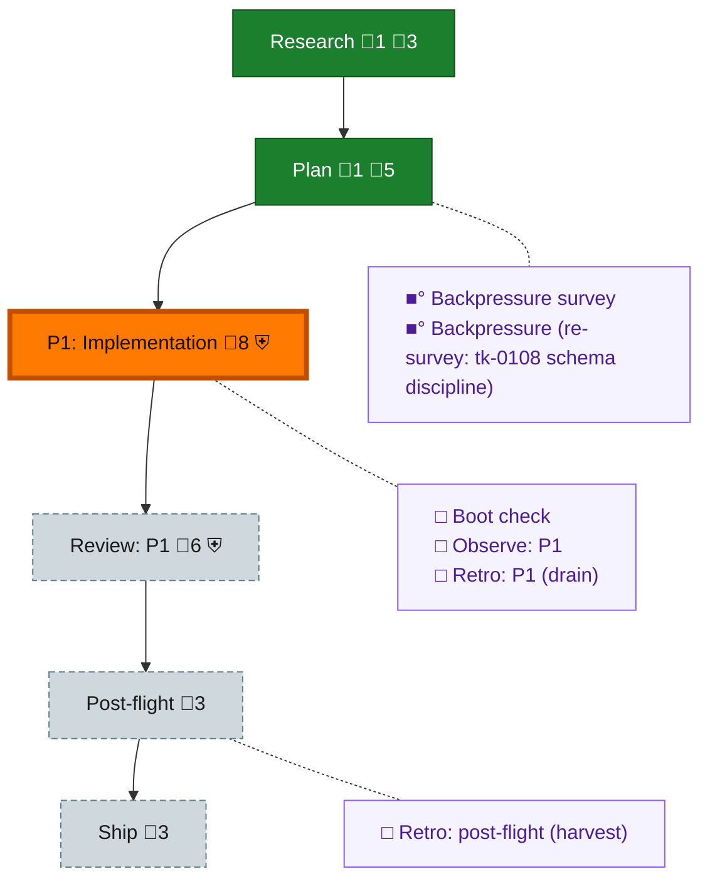

<!-- GENERATED by `harness flow render` — do not hand-edit; regenerate from the flow JSON. -->
# Flow · the-flow

**Kind**: flight-plan · **Now**: phase-1 · **Intent**: single strong worker executes the wiring; o-prime verifies via the e2e demo · **Nodes**: 12 · **Events**: 13

**Rail**: ◆─◆─[ ◇─◇─◇ ]─◇  ◆ Research · ◆ Plan · [ ◇ P1: Implementation · ◇ Review: P1 · ◇ Ship ] · ◇ Post-flight

**Legend** — colour = type/status: 🟩 done · 🟢 in-progress · 🟥 blocked · 🟦 known · ⬜ assumed · 🔶 decision · 🗣 user input · 🟪 harness chore (faded = not yet done) · 🤖 companion · 🛠 worker · 🟧 current (you are here). Badges: 💬 comments · 📄 artifacts · 📝 instructions · 🧰 chore (° optional / recommended / ‼ strongly-recommended; ✓ done · ✕ skipped) · ⛨ dd gate (terminal/total from the last evaluation; ✓ = open). ⛨✓/⛨✕ = a plan-validate check gate (green / not green).

## Node log

### research · Research
- `2026-08-26T05:11:02.848Z` · agent · validation — decision:folded reason:research = the day's landed substrate + 3 workshops; no dossier needed. time:2026-08-26T05:3xZ

### plan · Plan
- `2026-08-26T05:11:03.108Z` · agent · validation — decision:done reason:lean campfire plan per Jordan; 7 tasks 5 ACs; validate 0 errors. time:2026-08-26

### backpressure · Backpressure survey
- `2026-08-26T05:11:03.359Z` · agent · validation — verdict:surveyed reason:5 BUILD rows, 2 sensors; certainty Confident (parts all landed+tested today). basis_sha256:56aec47c773121f948e07c60d2662a9e936934cf012e4b0596e42c65012456ad time:2026-08-26

### backpressure-e33506f4e497 · Backpressure (re-survey: tk-0108 schema discipline)
- `2026-08-26T05:13:10.834Z` · agent · validation — verdict:re-surveyed reason:tk-0108 added (schema check+doctor apply) under existing bp-0001; rows unchanged. basis_sha256:e33506f4e497c056495759dac00c53d19f4225f9c83721b91a4c5b822b8fb993 time:2026-08-26
- `2026-08-26T05:13:55.060Z` · agent · validation — verdict:re-surveyed reason:tk-0108 extended (db-create + single-responsibility store admin fns); rows unchanged. basis_sha256:e33506f4e497c056495759dac00c53d19f4225f9c83721b91a4c5b822b8fb993
