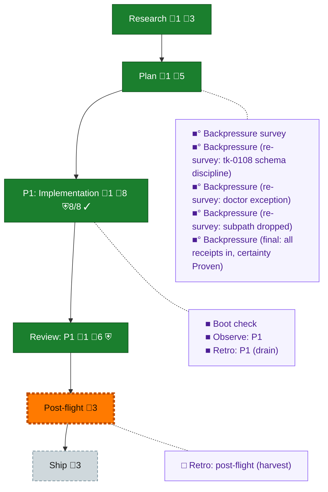

<!-- GENERATED by `harness flow render` — do not hand-edit; regenerate from the flow JSON. -->
# Flow · the-flow

**Kind**: flight-plan · **Now**: post-flight · **Intent**: plan complete; ship = the work is already on main (direct-to-main mode); archive at leisure · **Nodes**: 15 · **Events**: 33

**Rail**: ◆─◆─[ ◆─◆─◇ ]─◇  ◆ Research · ◆ Plan · [ ◆ P1: Implementation · ◆ Review: P1 · ◇ Ship ] · ◇ Post-flight

**Legend** — colour = type/status: 🟩 done · 🟢 in-progress · 🟥 blocked · 🟦 known · ⬜ assumed · 🔶 decision · 🗣 user input · 🟪 harness chore (faded = not yet done) · 🤖 companion · 🛠 worker · 🟧 current (you are here). Badges: 💬 comments · 📄 artifacts · 📝 instructions · 🧰 chore (° optional / recommended / ‼ strongly-recommended; ✓ done · ✕ skipped) · ⛨ dd gate (terminal/total from the last evaluation; ✓ = open). ⛨✓/⛨✕ = a plan-validate check gate (green / not green).

## Node log

### research · Research
- `2026-08-26T05:11:02.848Z` · agent · validation — decision:folded reason:research = the day's landed substrate + 3 workshops; no dossier needed. time:2026-08-26T05:3xZ

### plan · Plan
- `2026-08-26T05:11:03.108Z` · agent · validation — decision:done reason:lean campfire plan per Jordan; 7 tasks 5 ACs; validate 0 errors. time:2026-08-26

### phase-1 · P1: Implementation
- `2026-08-26T06:33:14.819Z` · agent · validation — verdict:done reason:all tasks/dw/ACs checked by sawfish (433c8a4), fault-path fixes 9ce9fae mutation-checked; o-prime re-ran e2e 14/14 + harness checks green + keyed evidence. Live run transcript = assets/first-light-run.md.

### review-1 · Review: P1
- `2026-08-26T06:33:15.084Z` · agent · validation — verdict:approved reason:independent critic pass (review file 2026-08-26-oprime-review-first-light.md): happy path clean (injection/guard/containment), 4 findings ALL FIXED with mutation-checked tests (9ce9fae). Receipts in the review file.

### backpressure · Backpressure survey
- `2026-08-26T05:11:03.359Z` · agent · validation — verdict:surveyed reason:5 BUILD rows, 2 sensors; certainty Confident (parts all landed+tested today). basis_sha256:56aec47c773121f948e07c60d2662a9e936934cf012e4b0596e42c65012456ad time:2026-08-26

### boot-1 · Boot check
- `2026-08-26T06:33:15.346Z` · agent · validation — verdict:done reason:covered by the day's real practice — boot green at every landing; observations captured to the shared buffer (DL-014..017 span this plan) and drained in the o-prime fleet retro 007.md.

### observe-1 · Observe: P1
- `2026-08-26T06:33:15.606Z` · agent · validation — verdict:done reason:covered by the day's real practice — boot green at every landing; observations captured to the shared buffer (DL-014..017 span this plan) and drained in the o-prime fleet retro 007.md.

### retro-1 · Retro: P1 (drain)
- `2026-08-26T06:33:15.851Z` · agent · validation — verdict:done reason:covered by the day's real practice — boot green at every landing; observations captured to the shared buffer (DL-014..017 span this plan) and drained in the o-prime fleet retro 007.md.

### backpressure-e33506f4e497 · Backpressure (re-survey: tk-0108 schema discipline)
- `2026-08-26T05:13:10.834Z` · agent · validation — verdict:re-surveyed reason:tk-0108 added (schema check+doctor apply) under existing bp-0001; rows unchanged. basis_sha256:e33506f4e497c056495759dac00c53d19f4225f9c83721b91a4c5b822b8fb993 time:2026-08-26
- `2026-08-26T05:13:55.060Z` · agent · validation — verdict:re-surveyed reason:tk-0108 extended (db-create + single-responsibility store admin fns); rows unchanged. basis_sha256:e33506f4e497c056495759dac00c53d19f4225f9c83721b91a4c5b822b8fb993

### backpressure-94b4c076b82f · Backpressure (re-survey: doctor exception)
- `2026-08-26T05:20:09.732Z` · agent · validation — verdict:re-surveyed reason:guardrail amended (doctor = named control-plane exception, option A); rows unchanged. basis_sha256:94b4c076b82fbb10a72f9ab7bf6d6966d7d885f9588bcf8358542721219a37b2

### backpressure-bf7063c83430 · Backpressure (re-survey: subpath dropped)
- `2026-08-26T05:20:38.616Z` · agent · validation — verdict:re-surveyed reason:subpath requirement dropped; live run = whole repo discovery-filtered. basis_sha256:bf7063c83430820c86c0e56987cb5fbff11130221d1e596f2ac8a54011edbf33

### backpressure-0ec890e28431 · Backpressure (final: all receipts in, certainty Proven)
- `2026-08-26T06:33:37.641Z` · agent · validation — verdict:final reason:all 5 rows checked with receipts; certainty Proven (live run + CI e2e + critic pass). basis_sha256:0ec890e28431044dab2a992c57ee3982982269d98e5db683b2da279a766e8fb4
